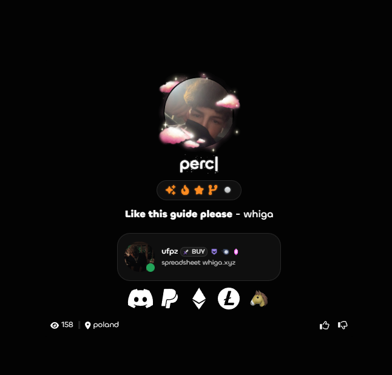
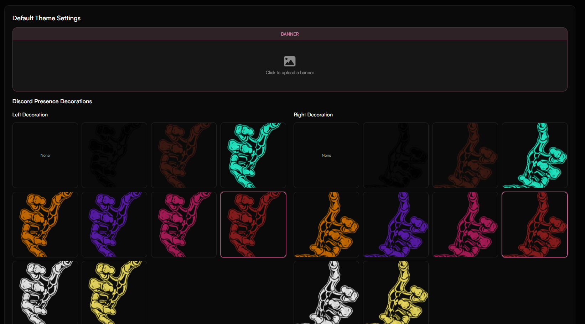
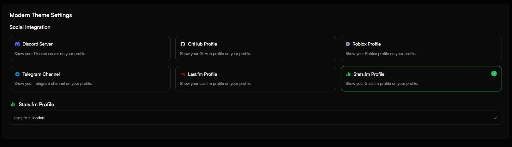
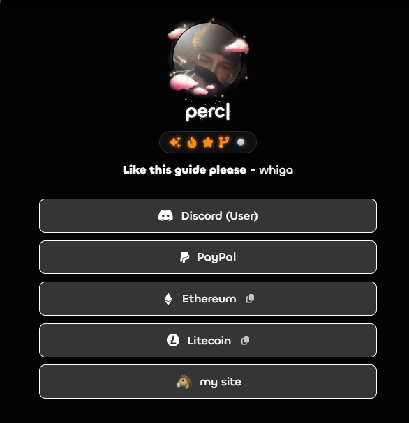

# Getting Started with Themes

<Steps>
  <Step title="Open the Themes Page">
    Head to [haunt.gg/dashboard/layout](https://haunt.gg/dashboard/layout) to explore available themes.
  </Step>
  <Step title="Select From a List Of Themes">
    Select from **3 available themes** right now.
  </Step>
  <Step title="Apply a Theme">
    Click **Apply Theme** to instantly update your profile with the selected theme.
  </Step>
</Steps>

## Available Themes

<Tabs>
  <Tab title="Default Theme">
  <Frame caption="Default theme without any decoration">
  
  </Frame>
    - Includes Discord Presence Decoration  
    - Features a customizable banner
  <Frame caption="Default theme Customization">
  
  </Frame>
  </Tab>
  <Tab title="Modern Theme">
  <Frame caption="Modern Theme">
  
  </Frame>
    - Integrates with multiple platforms:  
      - Discord Server  
      - GitHub  
      - Roblox  
      - Telegram  
      - Last.fm  
      - Stats.fm  
  <Frame caption="Modern Theme Customization">
  
  </Frame>
  </Tab>
  <Tab title="Simplistic Theme">
    - Minimalist design with no extra integrations  
    - Clean and lightweight look  
    <Frame caption="Simplistic Theme">
      
    </Frame>
  </Tab>
</Tabs>
